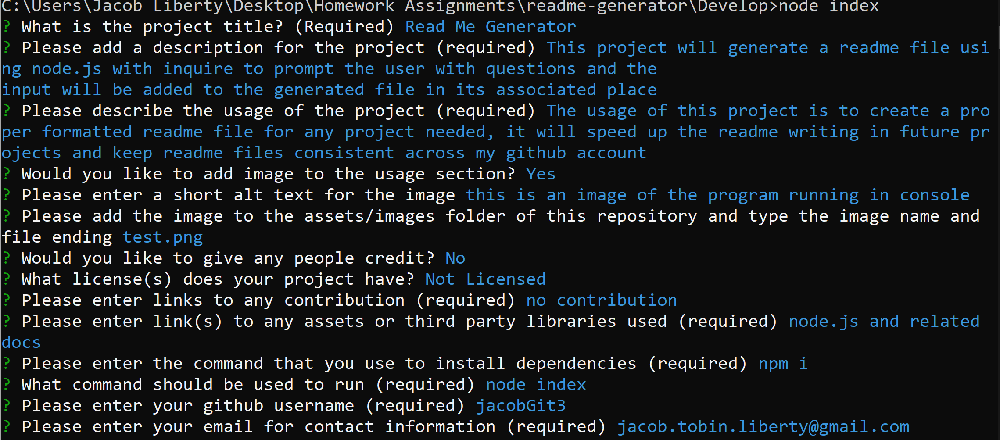

  # test
  [](https://opensource.org/licenses/MPL-2.0)

  ## Table of Contents:

  ---
  * [Description](#description)
  * [Installation](#installation)  
  * [Usage](#usage)  
  * [Credits](#credits)    
  * [Tests](#tests)  
  * [Questions](#questions)  

  ## Description

  ---
  test

  ## Installation:

  ---
  To install all necessary dependencies for this program,
  open the console and run the following command:  
  ```npm i```

  ## Usage

  ---
  test
  

  ## Credits

  ---
  
    ### Collaborators:
    Name: ward
    Github: https://github.com/Valaar
    

  ### Third Party Assets:
  node.js
  
  ### Third Party Docs / Contribution:
  www.google.com

  ## Tests

  ---
  To test this application run this command in the console:  
  ```node index```

  ## Questions

  ---
  For any questions feel free to reach out through the following contacts:  

  Email: a@a  
  Github: https://github.com/jacobGit3  
  